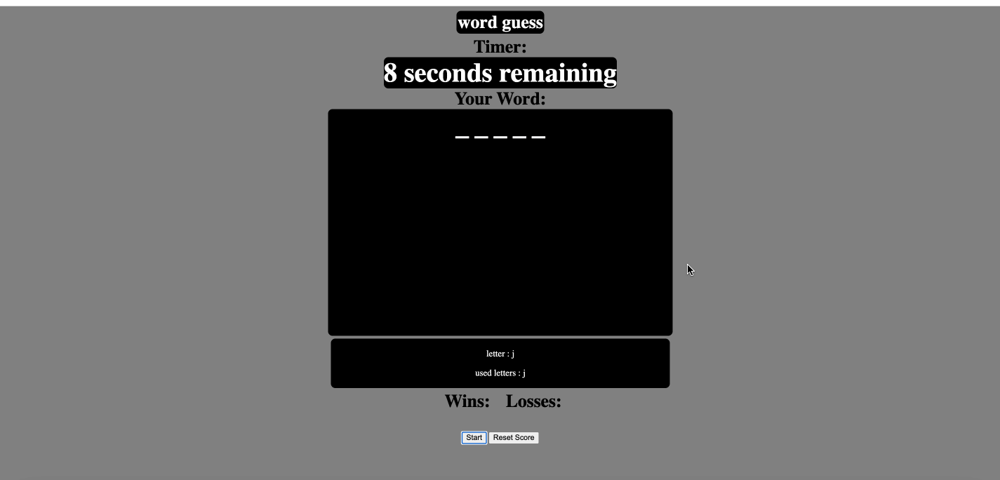

# word-guess        
## Details
The following is a word guess project similar to the game hangman. Available words are relative to coding with HTML, CSS, and Javascript. Within the application there is a local storage getitem and setitem, so even if the page is refreshed the score will stay the same. Only way to clear the score is to click the "reset score" button. 
The application aloows for the hidden word to be displayed as underscores and when the correct letter is guessed, the letter takes on the place of the underscore. 

## Installation
The following application will require the following:
* IDE capable of running HTML, CSS, and Javascript
* Web browser(preferably google chrome)
* github

## Steps
* Fork the repository and clone through terminal
* Open file in IDE
* Open the file in Web browser to view At this point in time changes can be made if desired. For example, words to be included into the array.
## Walkthrough
once the file is open in a Web browser, you can start by pressing the start button. Which will start the countdown, display a random word, and allow the user to input letters. If the word is correctly filled in the win count will increase by one. If the word is not filled in by the time the countdown reaches zero you lose and the loss count will increase by one. To reset your total score press the "reset score" button. This clears the score and allows the user to restart the game with a new record. 

## Code
* HTML
* CSS
* Javascript
### Link
https://rich-f-p.github.io/word-guess/ 
### License
* [License: MIT](https://opensource.org/licenses/MIT) : click to learn more
### Author
Mateo Navarro & Richard Ferry